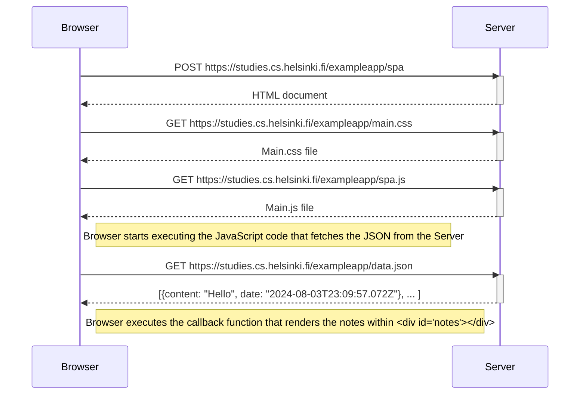

```mermaid

sequenceDiagram
    participant Browser
    participant Server

    Browser->>Server: POST https://studies.cs.helsinki.fi/exampleapp/spa
    activate Server
    Server-->>Browser: HTML document
    deactivate Server

    Browser->>Server: GET https://studies.cs.helsinki.fi/exampleapp/main.css
    activate Server
    Server-->>Browser: Main.css file
    deactivate Server

    Browser->>Server: GET https://studies.cs.helsinki.fi/exampleapp/spa.js
    activate Server
    Server-->>Browser: Main.js file
    deactivate Server

    Note right of Browser: Browser starts executing the JavaScript code that fetches the JSON from the Server

    Browser->>Server: GET https://studies.cs.helsinki.fi/exampleapp/data.json
    activate Server
    Server-->>Browser: [{content: "Hello", date: "2024-08-03T23:09:57.072Z"}, ... ]
    deactivate Server

    Note right of Browser: Browser executes the callback function that renders the notes within <div id='notes'></div>
```
