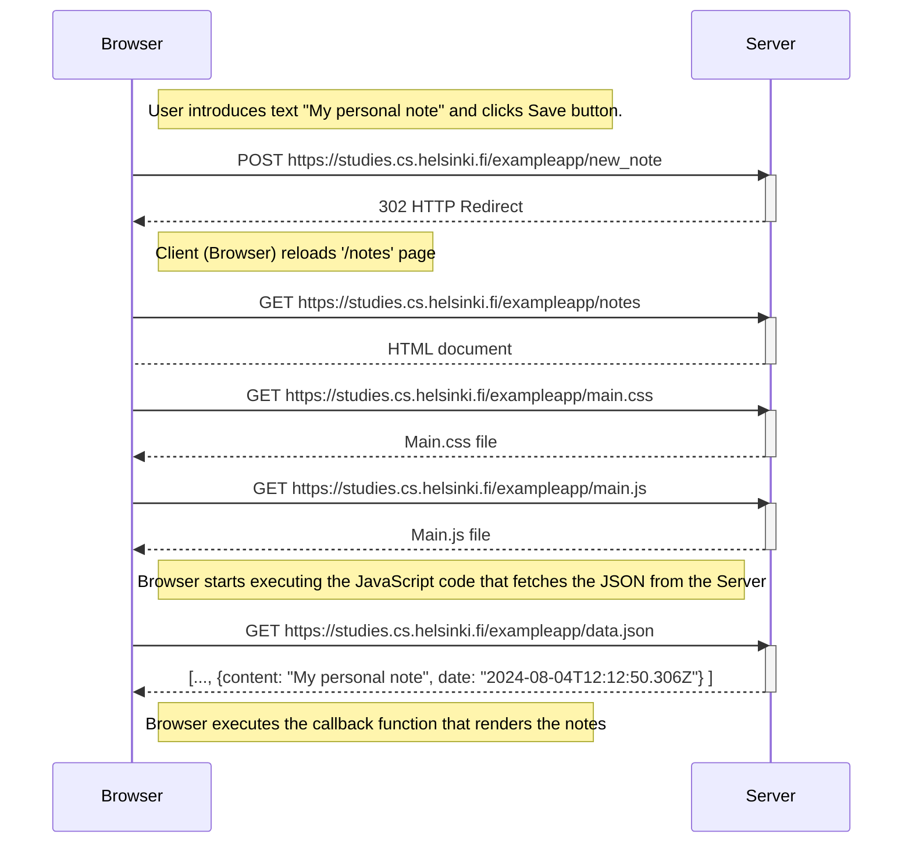

```mermaid

sequenceDiagram
    participant Browser
    participant Server

    Note right of Browser: User introduces text "My personal note" and clicks Save button.

    Browser->>Server: POST https://studies.cs.helsinki.fi/exampleapp/new_note
    activate Server
    Server-->>Browser: 302 HTTP Redirect
    deactivate Server
    Note right of Browser: Client (Browser) reloads '/notes' page

    Browser->>Server: GET https://studies.cs.helsinki.fi/exampleapp/notes
    activate Server
    Server-->Browser: HTML document
    deactivate Server

    Browser->>Server: GET https://studies.cs.helsinki.fi/exampleapp/main.css
    activate Server
    Server-->>Browser: Main.css file
    deactivate Server

    Browser->>Server: GET https://studies.cs.helsinki.fi/exampleapp/main.js
    activate Server
    Server-->>Browser: Main.js file
    deactivate Server

    Note right of Browser: Browser starts executing the JavaScript code that fetches the JSON from the Server

    Browser->>Server: GET https://studies.cs.helsinki.fi/exampleapp/data.json
    activate Server
    Server-->>Browser: [..., {content: "My personal note", date: "2024-08-04T12:12:50.306Z"} ]
    deactivate Server

    Note right of Browser: Browser executes the callback function that renders the notes
```
